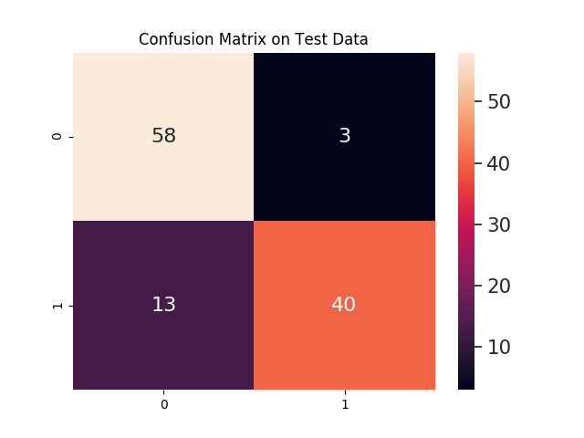

# Homeostatic-Neural-Networks
Non-official and toy implementation of the fun paper: "Need is All You Need: Homeostatic Neural Networks Adapt to Concept Shift"

## Link to the Very-Recommended Paper
https://arxiv.org/pdf/2205.08645.pdf

### Paraphrasing the paper
" Our homeostatic design exposes the artificial neural network’s thinking machinery to the consequences of its own "thoughts", illustrating the advantage of putting one’s own "skin in the game" to improve fluid intelligence." 😳

## The model
In the paper they use Multi-Layer Perceptron and MNIST dataset. I wanted to try a CNN and a more "complex" data, so I used AlxexNet and 25k images of Dogs and Cats. I used the same methodology explained kindly in pseudo-code in the paper. I love when they do that. But I'm afraid there could be a chance that I under/over-estimate the model and optimizer copy creation. It all seems to work fine and I love the idea in general.

## Results
I've used Dogs -> '0' as an excitatory and Cats -> '1' as an inhibitory (obviously...).

My best model performed a nice 87% accuracy on test data. Pretty nice taking in account the model used! 

